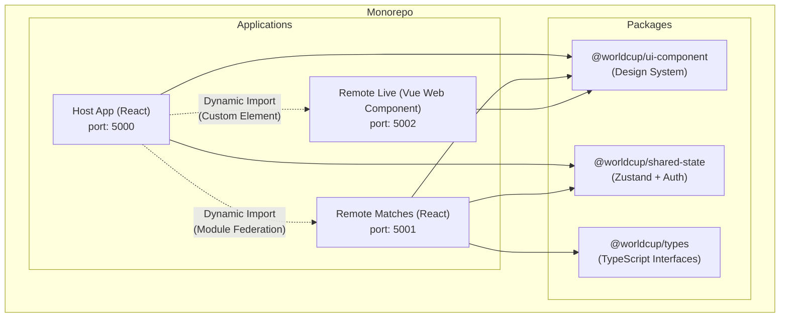
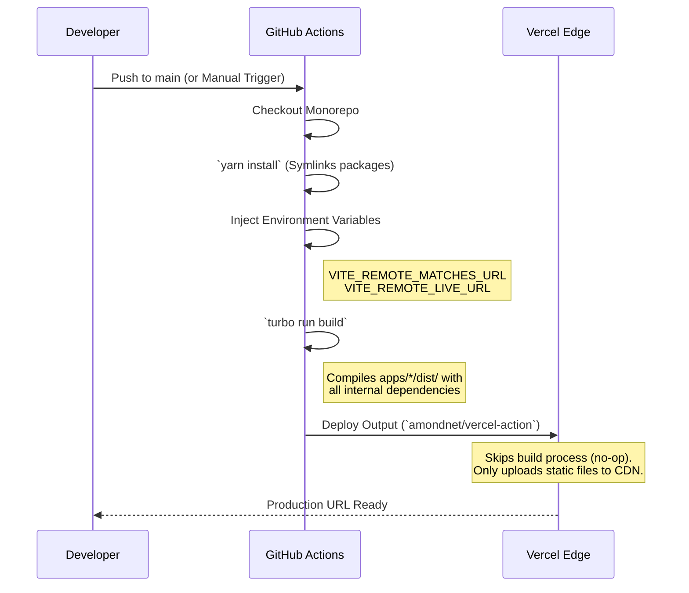

# 🏆 World Cup 2026 Admin Dashboard

A production-ready Microfrontend (MFE) architecture built with **React**, **Vue**, **Vite**, and **Module Federation**. This project demonstrates how to orchestrate multiple independent applications within a single monorepo, sharing state, UI components, and TypeScript definitions while deploying seamlessly to **Vercel** via **GitHub Actions**.

## 🏗 Microfrontend Architecture

The system is composed of a **Host Application** and multiple **Remote Applications**, all residing within a Yarn workspaces monorepo.



### Application Boundaries

1.  **Host App** (`apps/host-app`): The main shell. It handles routing, global layout, and orchestrates the loading of remote modules.
2.  **Remote Matches** (`apps/remote-matches`): A standard React remote application. It exposes a complex routing system (`MatchList`) that the Host integrates transparently.
3.  **Remote Live** (`apps/remote-live`): A Vue 3 application compiled into a standard Web Component (`<wc-live-score>`). It demonstrates true framework-agnostic microfrontends through the Custom Elements API and Shadow DOM isolation.

## 🚀 CI/CD Pre-built Deployment Architecture

One of the most complex challenges in monorepos is deploying sub-applications that depend on local workspace packages. We utilize a **"Pre-built on GitHub Actions"** strategy to solve Vercel build context limits.



## 🧠 Lessons Learned & Technical Solutions

During the development of this architecture, several critical issues were encountered and resolved.

### 1. Monorepo Dependency Resolution on Vercel
**The Problem:** Vercel deployments failed with "Cannot find module `@worldcup/ui-component`". Vercel's isolated build environments for individual sub-directories couldn't naturally resolve the hoisting and symlinking of the monorepo's root packages.
**The Solution:** We bypassed Vercel's internal build step. Instead, we compile the applications using Turborepo inside **GitHub Actions** (where the full monorepo context is available). We then deploy the already compiled `dist/` folders directly to Vercel.

### 2. Vite Environment Variable Overrides
**The Problem:** The production URLs for the remotes were constantly falling back to `localhost:5001`. Vite's `loadEnv()` reads from `.env.production` unconditionally, which overwrote the dynamic `process.env` variables injected via GitHub Secrets.
**The Solution:** Removed `loadEnv()` reliance for dynamic CI/CD variables. We explicitly map `process.env.VITE_REMOTE_MATCHES_URL` directly inside `vite.config.ts`, ensuring that GitHub Actions can securely inject environment details at build time without them being clobbered by empty `.env` files.

### 3. Cross-Framework CSS Isolation
**The Problem:** Global CSS from the Host App was conflicting with the styles of the remote modules. Attempting to manage complex Vite aliases for shared CSS caused "Configuration Hell".
**The Solution:** 
- **React Remotes:** Enforced the strict use of CSS Modules (`*.module.css`) to automatically hash classes (e.g., `._container_abc123`).
- **Vue Remotes:** Packaged the Vue component as a Web Component using `defineCustomElement`. This inherently utilizes the **Shadow DOM**, completely isolating its CSS from the React Host, while still allowing the intake of global CSS token variables.

### 4. React Router Context inside Remote Apps
**The Problem:** Calling `useNavigate()` inside the Host app immediately threw errors if it resided outside `BrowserRouter`. Conversely, Remote applications maintaining their own standard `BrowserRouter` caused routing conflicts with the Host.
**The Solution:** 
- The Host manages the main URL using `BrowserRouter`.
- Remote applications manage internal states using `MemoryRouter`. The Host passes down an `initialPath` and syncs changes via an `onNavigate` communication bridge, preserving deep linking without routing collisions.

## 🛠 Local Development Setup

To run the entire Microfrontend infrastructure locally, note that `vite-plugin-federation` requires remote applications to be built and served via `preview` to correctly expose `remoteEntry.js`.

```bash
# 1. Install dependencies (Workspace root)
yarn install

# 2. Build the remote modules (along with packages)
yarn build

# 3. Open two separate terminals to run the servers:

# Terminal A: Serve the remote applications via preview (Ports: 5001, 5002)
yarn turbo run preview --filter=remote-matches --filter=remote-live

# Terminal B: Start the Host application in development mode (Port: 5000)
yarn turbo run dev --filter=host-app
```

Visit `http://localhost:5000` to interact with the full system.
