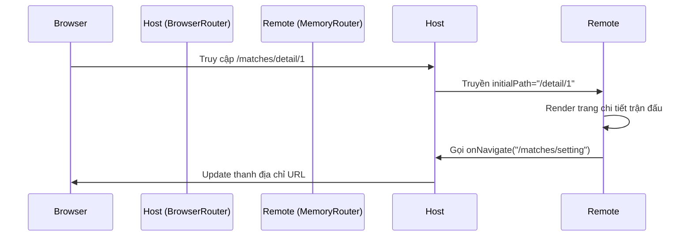

# 🏆 World Cup 2026 Microfrontend Dashboard

Hệ thống Dashboard quản lý và theo dõi giải vô địch bóng đá thế giới 2026, được xây dựng trên kiến trúc **Microfrontend (MFE)** hiện đại, sử dụng **Vite Module Federation** và **Turborepo**.

---

## 🏗️ Kiến trúc Hệ thống (Architecture Breakdown)

Hệ thống được thiết kế theo mô hình Monorepo với các tầng tách biệt rõ ràng:

### 1. Apps (Microfrontends)
-   **`host-app` (React)**: "Bộ não" điều phối. Quản lý Header, Menu, Auth State và đóng vai trò Container để nhúng các Remotes.
-   **`remote-matches` (React)**: Module quản lý lịch thi đấu. Sử dụng `MemoryRouter` để điều hướng nội bộ mà không làm hỏng URL của Host.
-   **`remote-live` (Vue)**: Module tỉ số trực tuyến. Được đóng gói dưới dạng **Web Component (Custom Element)** để đảm bảo tính cô lập tuyệt đối (Shadow DOM).

### 2. Shared Packages (The Glue)
-   **`@worldcup/ui-component`**: Thư viện UI dùng chung được xây dựng theo **Atomic Design**. Đảm bảo tính nhất quán (Consistent Design) trên toàn hệ thống.
-   **`@worldcup/shared-state`**: Quản lý trạng thái chung (User, Theme) sử dụng **Zustand**.
-   **`@worldcup/types`**: Định nghĩa TypeScript tập trung, đóng vai trò là "Contract" (Hợp đồng dữ liệu) giữa các MFE.

---

## 🚀 Tính năng nổi bật đã triển khai

### 1. Independent Deployment (Triển khai độc lập)
-   Mỗi MFE có một Pipeline CI/CD riêng trên **GitHub Actions**.
-   Cơ chế **Path-based triggering**: Chỉ deploy module nào có sự thay đổi code thực sự, giúp tiết kiệm thời gian và tài nguyên.
-   Tự động Inject Production URL vào Host thông qua Environment Variables.

### 2. Contract Testing
-   Hệ thống CI tích hợp bước kiểm tra kiểu (**TypeScript Compile Check**) xuyên qua các package. 
-   Nếu một thay đổi ở `packages/types` gây lỗi cho bất kỳ MFE nào, Pipeline sẽ báo đỏ và chặn quá trình deploy.

### 3. CSS Isolation (Cô lập giao diện)
-   Sử dụng **CSS Modules** cho React Remotes.
-   Sử dụng **Shadow DOM** cho Vue Remotes.
-   Hệ thống **CSS Tokens** giúp đồng bộ màu sắc/typography nhưng vẫn giữ được sự độc lập về layout.

---

## 🛠️ Hướng dẫn vận hành

### Chạy Local (Development)
```bash
# Cài đặt toàn bộ dependencies
yarn install

# Khởi chạy tất cả module cùng lúc
yarn dev
```

### Build & Preview (Production simulation)
```bash
# Build tất cả apps và packages
yarn build

# Xem thử kết quả build
yarn preview
```

---

## 🌐 Sơ đồ luồng điều hướng (Routing Sync)



---

## 📋 Danh sách công việc tiếp theo (Roadmap)
- [ ] Tích hợp **TanStack Query** để quản lý Server State.
- [ ] Triển khai **Error Boundaries** để Host không bị sập khi một Remote bị lỗi.
- [ ] Viết **E2E Smoke Tests** bằng Playwright để kiểm tra luồng tích hợp giữa các MFE.

---
*Dự án được thực hiện bởi Antigravity Pair Programming Team.*
